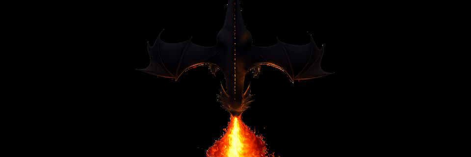
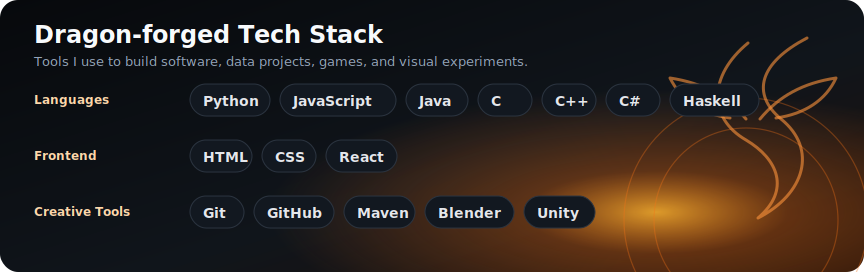

# Hi, I'm Raymond

Computer Science undergraduate at Bandung Institute of Technology (ITB), class of 2024. I am focused on building a strong foundation in software engineering, data science, and artificial intelligence.

I enjoy turning ideas into practical software, learning how systems work, and exploring the overlap between code, games, and visual animation.

## Focus

- Software engineering and application development
- Data science and artificial intelligence
- Game development and visual animation

## Tech Stack

**Languages:** Python, JavaScript, Java, C, C++, C#, Haskell  
**Frontend:** HTML, CSS, React  
**Tools & Creative:** Git, GitHub, Maven, Blender, Unity

## GitHub Activity

